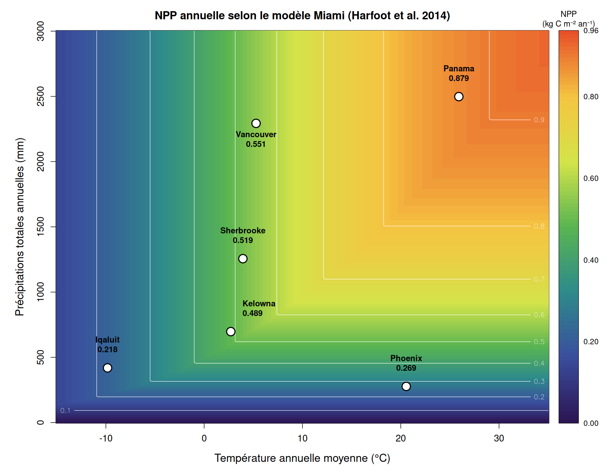

# Model Description: A Hierarchical Vegetation Model with Local and Regional Dynamics

## Overview

We model vegetation hierarchically, distinguishing local patch dynamics from regional (cell-level) occupancy dynamics. A grid cell is composed of a very large number of small patches, so large that we track only the proportion of patches belonging to each vegetation type and age class. Each patch is small enough to contain at most one tree species, but it always contains herbs.

There are three functional groups: *evergreen trees*, *deciduous trees*, and *herbs*. After a disturbance (fire), all biomass in a patch is reset to zero and herbs are the first to establish. Forest develops through the subsequent growth of tree biomass and progressive shading of herbs by tree canopy.

The fire return interval differs between tree types and drives regional turnover. Differences in community composition across locations emerge from climate-dependent parameters and variation in herbivore pressure.

## State Variables and Notation

The index $i$ refers to any functional group (herbs, evergreen, or deciduous), while $j$ refers specifically to tree species (evergreen or deciduous only), excluding herbs.

- $B_{i,x,t}$: total leaf biomass (g wet matter) of functional group $i$ at location $x$ and time $t$, integrated over the cell area.
- $p_{j,a,x,t}$: fraction of patches occupied by tree type $j$ at patch age $a$ (time since last fire) at location $x$ and time $t$. The constraint $\sum_{a}\sum_{j} p_{j,a,x,t} = 1$ ensures all patches are accounted for.
- $b_{j,a,x,t}$: leaf biomass density (g wet matter m$^{-2}$) of tree species $j$ in patches of age $a$.
- $b_{\mathrm{herb}|j,a,x,t}$: leaf biomass density of herbs in patches of tree type $j$ at age $a$. Herbs and trees coexist in all patches, but tree species do not coexist within a single patch.
- Total biomass of functional group $i$ is:

$$B_{i,x,t} = A_{\mathrm{cell}} \sum_{a} p_{i,a,x,t}\, b_{i,a,x,t}$$

where $A_{\mathrm{cell}}$ is the cell area in m$^2$. For herbs, the sum runs over both patch types weighted by their respective occupancy.

- $r_{j,x,t}$: relative biomass of tree species $j$ among trees only:

$$r_{j,x,t} = \frac{B_{j,x,t}}{\sum_{j'} B_{j',x,t}}$$

## Local Biomass Dynamics

The leaf biomass of each functional group in a patch of a given age and type follows a discrete-time difference equation adapted from Harfoot et al. (2014):

$$b_{i,a,x,t+\Delta t} = b_{i,a,x,t} + \Delta^{\mathrm{Growth}}_{i,a,x,t} - \Delta^{\mathrm{Mort}}_{i,a,x,t}$$

### Mortality

$$\Delta^{\mathrm{Mort}}_{i,a,x,t} = \delta\,\mu_{i,x,t}\,b_{i,a,x,t} + L_{i,a,x,t}$$

where $\mu_{i,x,t}$ is the mean annual leaf mortality rate (yr$^{-1}$) of functional group $i$, $\delta$ is a scalar converting the annual rate to the model time step, and $L_{i,a,x,t}$ is the leaf biomass consumed through herbivory during one time step. For constant herbivore populations:

$$L_{i,a,x,t} = \beta_i\, b_{i,a,x,t}$$

where $\beta_i$ (yr$^{-1}$) is the functional-group-specific herbivory rate.

### Growth and Competition

$$\Delta^{\mathrm{Growth}}_{i,a,x,t} = \mathit{NPP}_{x,t}\;\psi\;\delta\;(1 - f_{\mathrm{struct},i,x})\;f_{\mathrm{LeafMort},i,x}\;C_{i,a,x,t}$$

where $\mathit{NPP}_{x,t}$ is monthly terrestrial NPP (kg C m$^{-2}$ month$^{-1}$), $\psi$ is the conversion factor from carbon to leaf wet matter, $f_{\mathrm{struct},i,x}$ is the fractional allocation of primary production to structural tissue, and $f_{\mathrm{LeafMort},i,x}$ is the fraction of non-structural production allocated to leaves. Herbs lack woody structural tissue, so by definition $f_{\mathrm{struct,herb}} \equiv 0$; the allocation formula (Section Climate-Dependent Parameters) applies to trees only ($j \in \{\mathrm{ever, decid}\}$).

#### Asymmetric competition via light attenuation

NPP is partitioned between herbs and the local tree species through an asymmetric competition term inspired by Beer's law. Trees shade herbs but herbs have no effect on trees. In an evergreen patch:

$$C_{\mathrm{herb},a,x,t} = e^{-\alpha\, b_{\mathrm{ever},a,x,t}}$$

and in a deciduous patch:

$$C_{\mathrm{herb},a,x,t} = e^{-\alpha\, b_{\mathrm{decid},a,x,t}}$$

where $\alpha$ (m$^2$ kg$_C^{-1}$) is the light-extinction coefficient. By the asymmetry assumption:

$$C_{\mathrm{ever},a,x,t} = C_{\mathrm{decid},a,x,t} = 1 - C_{\mathrm{herb},a,x,t}$$

so that $C_{\mathrm{herb}} + C_{\mathrm{tree}} = 1$ within each patch.

## Regional Occupancy Dynamics

### Aging and Disturbance

Each time step, a fraction $e_{j,x,t}$ of patches of tree type $j$ is disturbed (burned) and returned to age 0. The remaining patches age by one step:

$$p_{j,a,t+\Delta t} = p_{j,a-1,t}\,(1 - e_{j,x,t}), \quad a \geq 1$$

The oldest age class, $a_{\max}$, acts as a lumped class accumulating all patches older than $a_{\max}$:

$$p_{j,a_{\max},t+\Delta t} = \bigl(p_{j,a_{\max}-1,t} + p_{j,a_{\max},t}\bigr)\,(1 - e_{j,x,t})$$

### Colonization of Burned Patches

The total flux of patches disturbed at time $t$ is:

$$D_{x,t} = \sum_{j}\sum_{a} p_{j,a,x,t}\,e_{j,x,t}$$

Newly burned patches are colonized by tree species in proportion to their regional relative biomass:

$$p_{j,0,x,t} = D_{x,t}\, r_{j,x,t}$$

Fire resets all leaf biomass to zero in newly created patches: $b_{j,0} = b_{\mathrm{herb}|j,0} = 0$.

## Climate-Dependent Parameters from Harfoot et al. (2014)

### Net Primary Production

Annual NPP follows the Miami model (Lieth 1975):

$$\mathit{NPP}^{T}_{x,y} = \min\!\left(\mathit{NPP}_{T,x},\; \mathit{NPP}_{P,x}\right)$$

$$\mathit{NPP}_{T,x} = \frac{\mathit{NPP}_{\max}}{1 + e^{\,c_p - m_p\,\bar{T}_x}}$$

$$\mathit{NPP}_{P,x} = \mathit{NPP}_{\max}\!\left(1 - e^{-\rho\, P_x}\right)$$

where $\mathit{NPP}_{\max}$ is the maximum possible NPP (kg C m$^{-2}$ yr$^{-1}$), $c_p$ and $m_p$ are coefficients relating NPP to mean annual temperature $\bar{T}_x$ (°C), and $\rho$ relates NPP to total annual precipitation $P_x$ (mm yr$^{-1}$).

Monthly NPP is obtained by scaling annual NPP by the monthly ($m$) seasonality factor at location $x$, $\omega_{x,m}$ (derived from Terra/MODIS remote-sensing data):

$$\mathit{NPP}^{T}_{x,m} = \mathit{NPP}^{T}_{x,y}\cdot\omega_{x,m}$$

### Fractional Allocation to Structural Tissue (trees only)

For tree functional groups ($j \in \{\mathrm{ever, decid}\}$), the fraction of NPP allocated to structural tissue is:

$$f_{\mathrm{struct},j,x} = \min\!\left(\frac{f^{\min}_{\mathrm{struct}}\,e^{\,\theta_{f_{\mathrm{struct}}}\,\mathit{NPP}^{T}_{x,y}}}{1 + f^{\min}_{\mathrm{struct}}\!\left(e^{\,\theta_{f_{\mathrm{struct}}}\,\mathit{NPP}^{T}_{x,y}} - 1\right)},\;0.99\right) \cdot f^{\max}_{\mathrm{struct}}$$

where $f^{\min}_{\mathrm{struct}} = 0.01$. For herbs, $f_{\mathrm{struct,herb}} \equiv 0$.

### Leaf Mortality Rates

Each functional group has its own annual leaf mortality rate depending on mean annual temperature $\bar{T}^C_x$ (°C):

$$\mu_{\mathrm{ever},x} = e^{\,(m_{e}\,\bar{T}^C_x - c_{e})}$$

$$\mu_{\mathrm{decid},x} = e^{\,-(m_{d}\,\bar{T}^C_x + c_{d})}$$

$$\mu_{\mathrm{herb},x} = \mu_{\mathrm{decid},x}$$

Herbs have the same seasonal leaf turnover as deciduous plants. The tree rates are bounded: $\mu_{\mathrm{ever},x} \in [\mu^{\min}_{e},\,\mu^{\max}_{e}]$ and $\mu_{\mathrm{decid},x} \in [\mu^{\min}_{d},\,\mu^{\max}_{d}]$.

### Fine Root Mortality Rate

$$\mu_{\mathrm{FineRoot},x,t} = e^{\,m_r\,T^C_{x,t} + c_r}$$

where $T^C_{x,t}$ is the monthly mean temperature (°C) at cell $x$ and time $t$. The rate is bounded: $\mu_{\mathrm{FineRoot},x,t} \in [\mu^{\min}_{r},\,\mu^{\max}_{r}]$.

### Fractional Leaf Allocation

The fraction of non-structural NPP allocated to leaves (versus fine roots) is computed separately for each functional group using its own leaf mortality rate:

$$f_{\mathrm{LeafMort},i,x} = \frac{\mu_{i,x}}{\mu_{i,x} + \mu_{\mathrm{FineRoot},x}}$$

### Fire Disturbance Rate

The base annual disturbance rate is adapted from the Madingley source code (`TerrestrialCarbon.cpp`). It combines two logistic responses: one to annual NPP and one to the fraction of the year subject to fire conditions ($F_{\mathrm{fire},x}$):

$$e_{\mathrm{base},x} = \max\!\left(e_{\min},\; s_{\mathrm{fire}} \cdot \frac{1}{1 + e^{-\kappa_{\mathrm{NPP}}\left(\mathit{NPP}^T_{x,y} - \eta_{\mathrm{NPP}}\right)}} \cdot \frac{1}{1 + e^{-\kappa_{\mathrm{LFS}}\left(F_{\mathrm{fire},x} - \eta_{\mathrm{LFS}}\right)}}\right)$$

Note: in the original Madingley model this formula computes a leaf mortality rate. Here it is reinterpreted as a **patch disturbance rate** (annual probability of complete biomass reset to zero).

Evergreen and deciduous trees differ in fire susceptibility. The type-specific annual rates are:

$$e_{j,x} = \min\!\left(1,\; k_j \cdot e_{\mathrm{base},x}\right), \quad j \in \{\mathrm{ever, decid}\}$$

where $k_j$ is a fire-susceptibility multiplier ($k_{\mathrm{ever}} > 1$: evergreens more prone; $k_{\mathrm{decid}} < 1$: deciduous less prone). The annual rate is converted to a monthly disturbance probability as:

$$e_{j,x,\Delta t} = 1 - (1 - e_{j,x})^{1/12}$$

## Parameter Values

| Symbol | Description | Value | Units |
|--------|-------------|-------|-------|
| **Miami NPP model** | | | |
| $\mathit{NPP}_{\max}$ | Maximum possible NPP | 0.9616 | kg C m$^{-2}$ yr$^{-1}$ |
| $c_p$ | Temperature NPP intercept | 0.2375 | -- |
| $m_p$ | Temperature NPP slope | 0.1006 | °C$^{-1}$ |
| $\rho$ | Precipitation NPP coefficient | 0.001184 | mm$^{-1}$ |
| **Structural allocation** | | | |
| $\theta_{f_{\mathrm{struct}}}$ | Scalar for $f_{\mathrm{struct}}$ | 7.155 | -- |
| $f^{\max}_{\mathrm{struct}}$ | Maximum structural allocation | 0.3627 | -- |
| **Evergreen leaf mortality** | | | |
| $m_e$ | Slope vs. temperature | 0.04027 | °C$^{-1}$ |
| $c_e$ | Intercept | 1.01307 | -- |
| $\mu^{\min}_{e}$ | Minimum rate | 0.01 | yr$^{-1}$ |
| $\mu^{\max}_{e}$ | Maximum rate | 24.0 | yr$^{-1}$ |
| **Deciduous leaf mortality** | | | |
| $m_d$ | Slope vs. temperature | 0.02058 | °C$^{-1}$ |
| $c_d$ | Intercept | $-1.1952$ | -- |
| $\mu^{\min}_{d}$ | Minimum rate | 0.01 | yr$^{-1}$ |
| $\mu^{\max}_{d}$ | Maximum rate | 24.0 | yr$^{-1}$ |
| **Fine root mortality** | | | |
| $m_r$ | Slope vs. temperature | 0.04309 | °C$^{-1}$ |
| $c_r$ | Intercept | $-1.4784$ | -- |
| $\mu^{\min}_{r}$ | Minimum rate | 0.01 | yr$^{-1}$ |
| $\mu^{\max}_{r}$ | Maximum rate | 12.0 | yr$^{-1}$ |
| **Conversion factors** | | | |
| $\psi$ | C to leaf wet matter | $0.476^{-1}\times 0.213^{-1}$ | g wet g$^{-1}$ C |
| **Fire disturbance (Madingley source code)** | | | |
| $s_{\mathrm{fire}}$ | Base fire scalar | 2.0 | -- |
| $\kappa_{\mathrm{NPP}}$ | NPP logistic slope | 8.419 | -- |
| $\eta_{\mathrm{NPP}}$ | NPP half-saturation | 1.149 | kg C m$^{-2}$ yr$^{-1}$ |
| $\kappa_{\mathrm{LFS}}$ | Fire-season logistic slope | 19.984 | -- |
| $\eta_{\mathrm{LFS}}$ | Fire-season half-saturation | 0.388 | -- |
| $e_{\min}$ | Minimum disturbance rate | $2.26 \times 10^{-6}$ | yr$^{-1}$ |
| **New model parameters (this study)** | | | |
| $\alpha$ | Beer-Lambert shading coefficient | 5.0 | m$^2$ kg$_C^{-1}$ |
| $\beta_i$ | Herbivory rate by functional group | 0.01--0.05 | yr$^{-1}$ |
| $k_{\mathrm{ever}}$ | Fire-susceptibility multiplier, evergreen | 1.5 | -- |
| $k_{\mathrm{decid}}$ | Fire-susceptibility multiplier, deciduous | 0.67 | -- |
| $a_{\max}$ | Maximum tracked patch age | 600 | months |

## Climate Space and NPP

The figure below shows annual NPP as a function of mean annual temperature and total annual precipitation according to the Miami model (Harfoot et al. 2014). The five case-study locations are shown as white circles.

## Application: Case-Study Locations

Derived parameter values computed for five locations spanning a broad climatic gradient. Climate inputs (T, P) are from the Madingley spatial rasters; AET and $F_{\mathrm{fire}}$ for non-Sherbrooke sites are estimated from regional climate knowledge (marked †). NPP and all downstream parameters are computed from the Madingley functions.

| Quantity | Sherbrooke 45.4°N, 71.9°W | Iqaluit 63.7°N, 68.5°W | Kelowna 49.9°N, 119.5°W | Vancouver 49.2°N, 123.1°W | Panama City 8.9°N, 79.5°W |
|---|---|---|---|---|---|
| Mean annual temperature (°C) | 3.94 | −9.83 | 2.71 | 5.28 | 25.91 |
| Total annual precipitation (mm yr$^{-1}$) | 1256 | 419 | 697 | 2293 | 2498 |
| Total annual AET (mm yr$^{-1}$) | 488 | 175† | 395† | 630† | 1450† |
| $F_{\mathrm{fire}}$ | 0.000 | 0.030† | 0.250† | 0.010† | 0.120† |
| Annual NPP (kg C m$^{-2}$ yr$^{-1}$) | 0.519 | 0.218 | 0.489 | 0.551 | 0.879 |
| $f_{\mathrm{struct}}$ | 0.106 | 0.017 | 0.091 | 0.124 | 0.307 |
| $\mu_{\mathrm{ever}}$ (yr$^{-1}$) | 0.426 | 0.244 | 0.405 | 0.449 | 1.031 |
| $\mu_{\mathrm{decid}}$ (yr$^{-1}$) | 3.047 | 4.045 | 3.125 | 2.964 | 1.939 |
| $\mu_{\mathrm{FineRoot}}$ (yr$^{-1}$) | 0.270 | 0.149 | 0.256 | 0.286 | 0.696 |
| $f_{\mathrm{LeafMort,ever}}$ | 0.612 | 0.621 | 0.612 | 0.611 | 0.597 |
| $f_{\mathrm{LeafMort,decid}}$ | 0.919 | 0.964 | 0.924 | 0.912 | 0.736 |

## References

- Harfoot, M.B.J., Newbold, T., Tittensor, D.P., Emmott, S., Hutton, J., Lyutsarev, V., Smith, M.J., Scharlemann, J.P.W., & Purves, D.W. (2014). Emergent global patterns of ecosystem structure and function from a mechanistic general ecosystem model. *PLOS Biology*, 12(4), e1001841.
- Lieth, H. (1975). Modelling the primary productivity of the world. In: Lieth, H. & Whittaker, R.H. (eds.), *Primary Productivity of the Biosphere*. Springer-Verlag, New York, pp. 237--263.
